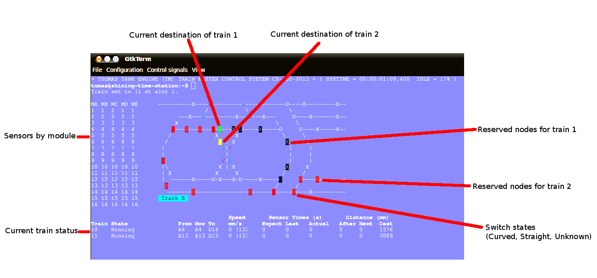
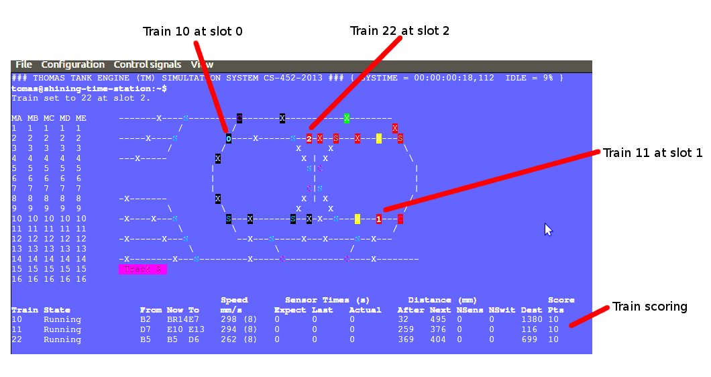

=========
CS 452 PF
=========

:Names: Robert Elder, Christopher Foo
:ID #: 20335246, 20309244
:Userids: relder, chfoo
:Date due: July 31, 2013

Running
=======

The executable is located at ``/u/cs452/tftp/ARM/relder-chfoo/pf-submit/final-demo.elf``.

The entry point is located at ``0x00045000`` or ``%{FREEMEMLO}`` It *must* be executed with caching enabled. (Caches not enabled by the program itself due to time constraints)::

    load -b %{FREEMEMLO} -h 10.15.167.4 ARM/relder-chfoo/pf-submit/final-demo.elf
    go -c

There are also other files:

``kern_simulation.elf``
    A train simulation that can support up to an arbitrary number of 10 trains.

``kern_test.elf``
    Runs 390 rock paper scissor tasks. (That's a lot of tasks!)

``orientation.elf``
    Program used to collect sensor data for train orientation.

Commands
++++++++

tr TRAIN SPEED
    Set the train speed.

rv TRAIN
    Slows, stops, and reverses train. The final speed is hard coded to 5.

sw SWITCH DIRECTION
    Changes the turnout direction. DIRECTION is either S or C.

q
    Quits the program.

map NAME
    Sets the current track. NAME should be A or B.

go TRAIN
    Begins the train route finding process. The train should start up, find position, and go to a random destination.

gf TRAIN
    Like ``go``, however, this make the train go forever by running ``go`` in an continuous loop.

num TRAINS
    Set the number of trains to be used.

paint
    Causes the interface to redraw itself.

rt
    Resets the train system by stopping the trains, clearing reservations, and clearing train engine states.

rps
    Runs Rock Paper Scissors program.

Pressing 'CTRL+Z' will cause the program to dump out a list of tasks information and statistics.   This is considered a debug operation, and as such it can cause future instability in the program.

Pressing CTRL+C will cause the program to exit immediately without shutting down the tasks.

Getting Started Quickly
-----------------------

To start up two trains

1. Select the appropriate map using the ``map`` command.
2. Set the number of trains to be used using ``num`` command.
3. Enter the first train using ``go TRAINNUM1 0``
4. Enter the second train using ``go TRAINNUM2 1``
5. If things go wrong, use the ``rt`` command

Description
===========

Assert
++++++

The assert statement, as usual, is enhanced to show Thomas The Tank Engine. Please do not be alarmed when you see it.

When an assertion failure occurs, the Stop command will be sent to avoid train collisions.

Train Navigation
++++++++++++++++

File: ``route.c``, ``tracks/track_data.c``, ``train_logic.c``, ``train_data_structures.h``

Train navigation is currently accomplished using a combination of fast and naive graph search algorithms, as well as a server called the SwitchMaster that is responsible for updating the positions of switches.

We have broken down the problem of navigation to anywhere on the map into two basic problems: The first is navigation to a point while considering the map as a directed graph.  In this situation we only consider moving in the forward direction.  In this context, it is now possible to navigate to anywhere on the map from all nodes because the graph is considered to be a directed one.  In the second case, we consider the map as an undirected graph, where any shortest path can be found by finding the shortest route in the undirected graph.  We can then express the problem of navigation between two points in the undirected graph as multiple navigations in a directed graph, while adding direction reversals in the middle.

To find a destination, a simple depth first recursive algorithm is used to build up a Route Info array. The Route Info array contains information about each track node and the switches it needs to switch. The algorithm avoids blacklisted switches.

Undirected Graph Model
++++++++++++++++++++++

In order to accurately model the train and its motion around the track, as well as predicted future positions on the track, we required another representation of the track to complemented the directed model that was provided.  It is for this reason that we have created a undirected graph model of the track based on the directed graph model.  This model also includes the trains as nodes, which enables us to apply standard graph-based algorithms to any nodes on the track graph, including the trains themselves.  This has significant advantages for tasks such as sensor attribution, collision detection, and route planning.  The advantage of including the trains as nodes in this model means that in this representation, we do not need sensor data to make decisions about what actions to take, and can rely on the current state of the model that has been predicted based on last sensor observations.  The undirected graph model allows us to consider route planning, independent of the number of reversals that are required on the route.  The other advantage is that trains are included as nodes so that the shortest distance between two trains can be calculated down to the micrometer at any point in time, as long as their approximate speed is known.

Sensor triggering can be used to infer observed train speeds, which can be used to simulate the motion of the train in a near continuous time manner.

Undirected Graph Data Structure
+++++++++++++++++++++++++++++++

The undirected graph model is built from the directed track node data.  Pointers are added to the directed nodes that point to the corresponding undirected graph nodes, and vice versa.  The undirected graph model is implemented as an adjacency list.  Since every node in this graph can have a maximum of 3 adjacent nodes, this significantly shortens the run time and memory requirements of many graph processing algorithms.

Dijkstra's
----------

Dijkstra's algorithm has been implemented for the undirected graph nodes.  The implementation of this algorithm is the standard one, with a run-time of :math:`O(|E| + |V|)`.  Testing has been done with a simulated track where multiple trains are sent on a random-walk around the track millions of times, calculating the shortest distance at each step.  Valgrind was also used to preclude the possibility of programming errors.

Routing and Navigation
----------------------

Currently, we use a simple recursive graph search algorithm for calculating paths.  This will soon be replaced by the much more accurate Dijkstra's algorithm once the undirected graph model is incorporated into the routing.  Once we have determined a series of nodes that we need to navigate through, we determine the set of switches that need to be changed from their current state, up until we possibly end up changing that same switch again (for re-entrant paths that only involve moving forward).  The switches are queued in the order in which they need to be switched so that the closest switch will be the first one to change.  If the train triggers a sensor that is not on the path it was expected to take, a warning is printed for debugging purposes.

Model
-----

The model of the train uses an estimated speed of the train computed using simple linear interpolation of the ideal speed of 45cm/s. Ideally, it should be using a finely calibrated tables, however, this could not be implemented within the time provided but the currently code is ready to support this.

Sensor readings augment the train model. It currently snaps the train to the location of the sensor. Ideally, we should use a rubber band method that gently interpolates the differences and jitter.

A simulation build has been provided that behaves similarly to the actual build. It randomly uses a sensor as the initial position.

Stopping
--------

For stopping we use a roughly approximated table for each train that will tell us how many millimeters before a sensor we need to issue a command to slow down.  This table was derived from empirical measurements and still needs a bit of calibration.  This is especially true on a specific train level, since different trains require different stopping distances.

A list of speeds for each node during stopping has also been determined empirically. Nodes that are near switches have a lower speed to avoid stopping on top of a switch. We risk the trains getting stuck on curves because it is preferred that trains become stuck rather than derailed by an activating switch.

Velocity
--------

Our trains move at a speed of 45 cm/s and we maintain this speed using a feedback control mechanism. The observed train speed is calculated by dividing the known track length between two sensors, and dividing this by the observed time taken to travel between them.  The trains use a floating point speed setting to avoid sending too many train speed commands and to dampen noise. The floating point speed setting is casted to an int and the command is issued if needed. The algorithm slowly increases the train speed when it arrives at a sensor too slowly, and decreases the speed quickly when it arrives too fast.

Sensor Malfunctions
-------------------

Sensor malfunctions are accounted for by maintaining a list of sensors that are known to malfunction on each track.  We use a blacklist of sensors to remember which sensors should not be navigated to, and which should be ignored when determining the train position.

Reservations
------------

The provided track nodes have been modified with an extra field called ``reserved``. It holds the train number of the reservation. Once the destination and route is calculated, all the nodes in the route are reserved. Once the train reaches its destination, the nodes are released from reservation.  The concept of switch reservations is taken care of, because while a train has reserved a switch, no other can attempt to queue a switch change.

A train will always check the node ahead to see if the node is reserved. If the node is reserved, it will stop and wait in the ``WAIT_FOR_RESERVATION`` state. During this state, it will generate a random number between 1 and 100. If the number is 1, it will reverse direction and attempt to find a new destination.

On-the-fly switching
--------------------

Although the current reservation prohibits multiple trains using switches by reserving it for the duration of the route, on-the-fly switching is implemented in case we were able to reduce the reservations needed. Each train looks ahead at the next 2 switches and computes the distance to them. If the switches are less than 50cm or the train will pass by them within 2 seconds, it will switch them to the correct route. We use this generous amount of time because the train model is not entirely accurate and switching early will reduce trains caught on the switches.

Lost train detection
--------------------

Lost trains are detected by the model if the train has been found to be not on its current path. It is able to detect this by running the train through the internal model and state of the switches. For example, if the switch queue is backlogged and the command to active the switch has not been sent yet, the model will move the train based on the current state of the switches. However, the model may not reflect reality, so the model will keep a counter of how many times it has determined that it is on the wrong part of the track. 

If a sensor reading has confirmed that it went to the wrong branch, the train will be put into the lost state and it can be concluded that the model was correct. If a sensor reading has snapped the train onto the correct route, then the switch has actually been put into the correct state and it can be concluded that the model has computed an incorrect train speed.

Ideally, it would be best to use timeouts and determine windowed distances to the sensors beyond each branch. However, only a portion of this feature was implemented but it was disabled. If given more time to fine tune the calibration, this feature would be useful for detecting incorrect train behaviour and allow use to recover from a lost train state.

When a train is lost in wrong location state. It will do nothing to be safe, however, it is possible for the train to recover by computing a new route.

Train Switch Master
-------------------

The Switch Master is responsible for picking up switch commands from the Train Server and calling Train Command Server. This task is a worker that removes the burden of waiting for train commands to complete.  

Train Engine Client
-------------------

The Engine Client is responsible for picking up train speed commands from the Train Server and calling the Train Command Server. Like the Switch Master, the task is a worker hired by the Train Server.

Train Engine States
-------------------

================================= =================================================================
Name                              Description
================================= =================================================================
IDLE                              The engine is stopped and waiting.
FINDING_POSITION                  The engine is moving slowly and waiting for a sensor
RESYNC_POSITION                   The engine has drifted from its calculated position and
                                  is attempting to find its location
FOUND_STARTING_POSITION           The engine has found its location
WAIT_FOR_DESTINATION              The engine is waiting for a destination to be calculated
GOT_DESTINATION                   The engine has calculated its destination
WAIT_FOR_ALL_READY                The engine is waiting for other engines to be found and ready
RUNNING                           The engine is running at high speeds to the destination
AT_DESTINATION                    The engine is at the destination and stopped.
NEAR_DESTINATION                  The engine has slowed down and is waiting for a
                                  sensor report.
REVERSE_AND_TRY_AGAIN             The engine is in a direction that provides no
                                  destination and is reversing to find a new
                                  sensor.
WAIT_FOR_RESERVATION              The engine has stopped and is waiting for the track to become 
                                  unreserved
WRONG_LOCATION                    The engine has entered an unauthorized section of the track
================================= =================================================================

GO
--

The go command operates as following:

1. Set the train speed to 5.
2. If a sensor is hit, the location of the train has been found.
3. Reserve the current location in the reservation system.
4. If there are other trains that need to find their location, wait for them.
5. Pick a random destination.
6. Calculate a route to the destination. 
7. If there is no possible route to destination, reverse the direction and go to step 5.
8. Activate the switches that do not overlap other routes or require switching multiple times.
9. Speed up the train to 14.
10. Read sensors and compute the speed, location, and distance to update the state of the train engine.
11. Using the sensor data and  feedback control system, adjust the speed to achieve a speed of 45 cm/s.
12. If the next node is a switch that needs to be activated, switch it.
13. If the distance to destination is within the stopping distance, slow the train down.
14. If the next node is reserved, wait until it is cleared. If it is not cleared and a random number generator generates a true condition, reverse direction and go to step 5.
15. Wait for a sensor and stop.

For an iterative version of the go command, see GF command which will iteratively use the go command after a train reaches its destination.

GF
--

The gf command operates as following:

1. Do steps 1-15 of the go command
2. Wait for 4 seconds
3. Goto step 5

Train Scoring
-------------

In this deliverable, trains are given points and they must optimize their high score.

The trains are given or removed points depending on what kind of events occur.

============== ================================================================
Points Awarded Event
============== ================================================================
10             Train found its initial position
-10            Train decided to not go anywhere
100            Train found arrived at its destination
-100           Train went off course
-5             Train slowed and sped back up unnecessarily 
5              Train found another path when the original was blocked
-5             Train computed a speed that was physically impossible
-5             Train computed a speed that was negative
5              Train computed a speed that was reasonable
============== ================================================================

UI Servers
++++++++++

Files used by UI servers: ``ui.c``, ``ansi.c``, ``maps/map_gen.py``, ``maps/map_a.txt``, ``maps/map_b.txt``

UI Server
---------

* ``atoi()`` no longer throws an assertion failure on bad  input

The UI Server is responsible for drawing the textual user interface. It draws a header, the time since start up, a system load indicator expressed in percentage, the command prompt, table of sensors readings, an ASCII diagram of the track layout, a table of train status, and a scrolled area of train information.

The command prompt supports up to 80 characters. Once this limit is reached, no input will be accepted and displayed. It supports backspace. Pressing the Enter key will execute the command and a response will be displayed under the command prompt. If an error occurs, it will be shown in yellow.

When a sensor is triggered, the UI Server will display an bold number on the table. Sensor data for the UI is cached by the Train Server so displayed sensor readings may not reflect actual state. Sensor states in the Train Server, however, reflect actual states.

The ASCII map shows sensors as X and bold X with underline. Switches are shown as U, C, or S which represent Unknown, Curved, or Straight. The ASCII map code was generated through a script from a text file.

A green highlight shows the destination of the first train. A yellow highlight shows the destination for other trains.

A black highlight shows the reservation of the first train. A red highlight shows the reservation for other trains.

The model's location of the train is indicated by a bold digit. If the model train and the actual train is on a sensor it will show a bold digit with underline.

Some of the hilights of the UI are found in figure 4.

    Figure 4

    Figure 5

UI Timer
--------

The UI Timer is responsible for sending a message to the UI Server. The timer tells the UI to update the clock and system load on the screen.

UI Keyboard Input Task
----------------------

The UI Keyboard Input task is responsible for calling ``Getc`` and sending the character to the UI Server.

UI Print Message Task
---------------------

This task is responsible for printing messages into the scrolled area. It uses the ANSI feature to set scrolling areas. It is separate from the UI Server as messages may be from higher priority tasks like the Train Server. It is called via the ``PrintMessage`` call.  This method was implemented as a non busy-waiting alternative for debug messages.

Source Code
===========

The source code is located at ``/u4/chfoo/cs452/group/pf-submit/io/project-final/``. It can be compiled by running ``make``.

Source code MD5 hashes::

    TODO

Elf MD5 hash::

    TODO

Git sha1 hash: ``TODO``

Appendix
========

System Calls
++++++++++++

``Create``
    Returns the new task id, ``ERR_K_INVALID_PRIORITY -1``, or ``ERR_K_OUT_OF_TD -2``

``MyTid``
    Returns the current task id

``MyParentTid``
    Returns the parent task id. The parent task id is always returned regardless of the parent's state.

``Pass``
    (Rescheduling happens as normal in the background.)

``Exit``
    Task is marked as ``ZOMBIE`` (and rescheduling happens as normal in the background).

``Send``
    Sends a message to the given task ID. ``-3`` code is not implemented.

``Receive``
    Blocks until a message is received. Returns the size of the message which will be typically ``MESSAGE_SIZE 16``

``Reply``
    Replies a message to the task. On errors ``-3`` ``-4``, an assert will fire before returning to aid in debugging.

``RegisterAs``
   Prepares a ``NameServerMessage`` structure with a message type of ``REGISTER_AS`` and sends the message to the Name Server. ``0`` is always returned because the Task ID is hard-coded and the call should never send to the wrong task.

``WhoIs``
    Prepares a ``WHO_IS`` message type and sends it to the Name Server. As noted in ``RegisterAs``, we either return a Task ID or 0 if the task has not been created. However, the task ID returned may be in a zombie state.

``AwaitEvent``
    Marks the task as ``EVENT_BLOCKED``. The task will be unblocked by the Scheduler. This call always returns 0 and the user task will be responsible for obtaining the data themselves. ``AwaitEvent`` supports only 1 task per event type.

``Time``
    Wraps a ``Send`` to the Clock Server. It first queries the Name Server for the Clock Server and then sends a ``TIME_REQUEST`` message. It expects back a ``TIME_REPLY`` message and returns the time.

``Delay``
    Similar to ``Time``, it sends a ``DELAY_REQUEST`` message and expects back a ``DELAY_REPLY`` message.

``DelayUntil``
    Similar to ``Time``, it sends a ``DELAY_UNTIL_REQUEST`` message and expects back a ``DELAY_REPLY`` message.

``TimeSeconds``, ``DelaySeconds``, ``DelayUntilSeconds``
    Same as above but in seconds. It simply converts the ticks into seconds before calling the system calls. These calls are simply for convenience.

``Getc``
    Sends a message to either Keyboard Input Server or Train Input Server. It will block until the servers have a character to return.

``Putc``
    Sends a message to either Screen Output Server or Train Output Server. The servers will place the character into the server's Char Buffer.

``PutString``
    Formats the string and calls ``Putc`` for every character.

``PutcAtomic``
    Like ``Putc``, but accepts multiple characters and guarantees the characters are placed into the queue sequentially. This call is useful to ensure that two byte commands are not separated by a single byte command.

``SendTrainCommand``
    Sends a message type ``TRAIN_COMMAND`` to the Train Command Server. The call is for convenience.

``PrintMessage``
    Similar to ``PrintMessage``, but this sends the string to the UI Print Server to be displayed on the lower half of the screen using a ``UI_PRINT_MESSAGE`` message type

Priorities
++++++++++

======================== ==========
Task                     Priority
======================== ==========
Clock Notifier            0
Clock Server              0
First Task                0
Name Server               1
Administrator             2
UART Bootstrap            3
Train IO Notifier         4
Train Input Notifier      4
Train Output Notifier     4
Keyboard Input Notifier   4
Screen Output Notifier    4
Train Input Server        5
Train Output Server       5
Screen Output Server      6
Keyboard Input Server     6
Train Server              7
UI Print Task             7
Train Command Server      8
Train Switch Master       8
UI Server                 8
Train Sensor Reader       9
Train Engine              9
Train Server Timer       10
UI Keyboard Input        12
UI Timer                 13
RPS Test Start           15
RPS Server               16
RPS Client               31
Idle Task                31
======================== ==========

