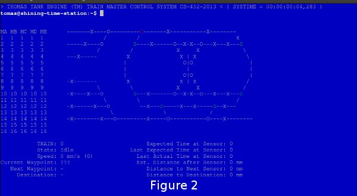
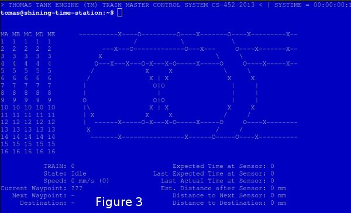

=========
CS 452 P1
=========

:Names: Robert Elder, Christopher Foo
:ID #: 20335246, 20309244
:Userids: relder, chfoo
:Date due: July 9, 2013

Running
=======

The executable is located at ``/u/cs452/tftp/ARM/relder-chfoo/p1-submit/kern.elf``.

The entry point is located at ``0x00045000`` or ``%{FREEMEMLO}`` It *must* be executed with caching enabled::

    load -b %{FREEMEMLO} -h 10.15.167.4 ARM/relder-chfoo/p1-submit/kern.elf
    go -c

Commands
++++++++

tr TRAIN SPEED
    Set the train speed.

rv TRAIN
    Slows, stops, and reverses train. The final speed is hard coded to 5.

sw SWITCH DIRECTION
    Changes the turnout direction. DIRECTION is either S or C.

q
    Quits the program.

map NAME
    Sets the current track. NAME should be A or B.

Figure 2 and Figure 3 show different map configurations.

go TRAIN
    Begins the train route finding process. The train should start up, find position, and go to a random destination.

gf TRAIN
    Like ``go``, however, this make the train go forever by running ``go`` in an continuous loop.

Pressing 'z' will cause the program to dump out a list of tasks information and statistics.   This is considered a debug operation, and as such it can cause future instability in the program.

Description
===========

Kernel
++++++

* Caching improves the performance of the program and will be mandatory for this deliverable.  We have finely tuned the duration of a time slice to be no longer than 700 microseconds.  Running the program without caches would require re-tuning of the time slice to prevent all CPU cycles being burnt up doing context switching.  The extremely small time quantum of 700 microseconds ensures fast responsiveness to train input and with the user interface.

* Interrupts have been completely refactored to increase stability with train communication.  This was done because we were previously attempting to send on the TXFE interrupt instead of waiting for CTS to be asserted.  We now listen for the modem status interrupt and correctly attempt to send information to the train only when CTS has been asserted after a de-assertion.

System Calls
------------

* System calls support up to 5 arguments.

``Create``
    Returns the new task id, ``ERR_K_INVALID_PRIORITY -1``, or ``ERR_K_OUT_OF_TD -2``

``MyTid``
    Returns the current task id

``MyParentTid``
    Returns the parent task id. The parent task id is always returned regardless of the parent's state.

``Pass``
    (Rescheduling happens as normal in the background.)

``Exit``
    Task is marked as ``ZOMBIE`` (and rescheduling happens as normal in the background).

``Send``
    Sends a message to the given task ID. ``-3`` code is not implemented.

``Receive``
    Blocks until a message is received. Returns the size of the message which will be typically ``MESSAGE_SIZE 16``

``Reply``
    Replies a message to the task. On errors ``-3`` ``-4``, an assert will fire before returning to aid in debugging.

``RegisterAs``
   Prepares a ``NameServerMessage`` structure with a message type of ``REGISTER_AS`` and sends the message to the Name Server. ``0`` is always returned because the Task ID is hard-coded and the call should never send to the wrong task.

``WhoIs``
    Prepares a ``WHO_IS`` message type and sends it to the Name Server. As noted in ``RegisterAs``, we either return a Task ID or 0 if the task has not been created. However, the task ID returned may be in a zombie state.

``AwaitEvent``
    Marks the task as ``EVENT_BLOCKED``. The task will be unblocked by the Scheduler. This call always returns 0 and the user task will be responsible for obtaining the data themselves. ``AwaitEvent`` supports only 1 task per event type.

``Time``
    Wraps a ``Send`` to the Clock Server. It first queries the Name Server for the Clock Server and then sends a ``TIME_REQUEST`` message. It expects back a ``TIME_REPLY`` message and returns the time.

``Delay``
    Similar to ``Time``, it sends a ``DELAY_REQUEST`` message and expects back a ``DELAY_REPLY`` message.

``DelayUntil``
    Similar to ``Time``, it sends a ``DELAY_UNTIL_REQUEST`` message and expects back a ``DELAY_REPLY`` message.

``TimeSeconds``, ``DelaySeconds``, ``DelayUntilSeconds``
    Same as above but in seconds. It simply converts the ticks into seconds before calling the system calls. These calls are simply for convenience.

``Getc``
    Sends a message to either Keyboard Input Server or Train Input Server. It will block until the servers have a character to return.

``Putc``
    Sends a message to either Screen Output Server or Train Output Server. The servers will place the character into the server's Char Buffer.

``PutString``
    Formats the string and calls ``Putc`` for every character.

``PutcAtomic``
    Like ``Putc``, but accepts multiple characters and guarantees the characters are placed into the queue sequentially. This call is useful to ensure that two byte commands are not separated by a single byte command.

``SendTrainCommand``
    Sends a message type ``TRAIN_COMMAND`` to the Train Command Server. The call is for convenience.

``PrintMessage``
    Similar to ``PrintMessage``, but this sends the string to the UI Print Server to be displayed on the lower half of the screen using a ``UI_PRINT_MESSAGE`` message type

Memory model
------------

The memory model looks like this::

    +----------------+ 0x0200_0000
    | RedBoot Stack  |
    +----------------+ 0x01fd_cfdc Starting value of redboot stack 
    | Redboot Buffer*|             after box reset
    +----------------+ 0x01FD_B09C 
    | Kernel Stack   |
    +----------------+ 0x01FD_B09C - sizeof(KernelState) - 400kb 
    | IRQ Stack      |             = KernelEnd
    +----------------+ KernelEnd - 500kb
    | User Stacks    |
    |                |
    +----------------+ 0x0005_2804 (_EndOfProgram specified in orex.ld)
    | Kernel         |
    +----------------+ 0x0004_5000 (%{FREEMEMLO} RedBoot alias)
    | RedBoot        |
    +----------------+ 0x0000_0000

``${FREEMEMLO}``
----------------

After consulting the RedBoot documentation, the entry point was moved to ``0x00045000`` to free up more memory for user stacks. We believe that this new memory location marks the start of safe memory that is not used as a guarantee from redboot and we have not found any reason we cannot move the entry point to this location.  This values comes from the a redboot alias %{FREEMEMLO} that can be used when loading the program instead of the literal address.

As well, we are able to have assert checks on stack boundaries. Using the ``_EndOfProgram`` linker symbol, we can check if a user stack pointer overwrites the kernel. There are checks for each user stack as well.

Stack values and sizes are configurable, and will generally give appropriate assertions if the memory model has conflicts that can cause corruption.

Message Passing
---------------

Messages are ``structs`` that are casted into ``char*``. This casting allows us to manipulate messages more easily with type safety rather than dealing with raw ``char``. Note we use GCC attribute syntax to word align the character array as the GCC compiler does not realize we are type punning.

Kernel Messages, messages that are copied into the kernel, are now stored into an array, using Dynamic Memory Allocation (see below), instead of using a combination of ring buffers and queues. Refactoring to a simpler solution allows us to reduce the load on our brain while debugging the kernel. See Dynamic Memory Allocation for more information.

The message size is fixed to 16 bytes. Using a fixed value allows for consistency. As well, this low value is meant to reduce the time spent on message copying.

Priority Queue
--------------

The Priority Queue uses 32 levels of priority by using 32 Queues.

Note the highest priority is 0 and the lowest priority is 31. Named priority levels are removed as they were no longer used. Explicit values are now required to remove ambiguity.

When retrieving an item, the Priority Queue uses an integer to track which priority level has items. When a bit is 1, it means there is at least one item in the queue. For example, ``00110000...`` means there is at least one item in priority 2 and 3 queues. The count leading zero instruction is used so that we avoid checking all 32 queues when getting an item. ``0`` is returned when there is no item.

We have also centralized all of the priorities into one file called ``priorities.h`` for easy manipulation.

Interrupt Handler
+++++++++++++++++

File: ``kernel_irq.c``

Vectored interrupts are used.

Timer3 is enabled and counts down from 5080 to give 10ms interrupt intervals. The kernel also sets the CPSR to allow interrupts.

The interrupt handler will call the scheduler to unblock tasks and it also acknowledge Timer3.

UART1RXINTR1, UART1TXINTR1, UART2RXINTR2, UART2TXINTR2, are enabled when there is a Task waiting for it. The IRQ handlers will disable the respective interrupt after it has fired. UART Clocking problems are avoided as our context switch is greater than 50 NOPs. 

Watchdog
--------

A watchdog was added to the scheduler. It runs as the lowest priority task. If the watchdog is not scheduled within 1,000,000 rounds, the scheduler will dump out task statistics and hang. This watchdog will indicate if any tasks are starved. If this condition does occur, it will report within a minute.

Assert
++++++

The assert statement has been enhanced to show Thomas The Tank Engine. Please do not be alarmed when you see it.

Bugs have been fixed related to entering assertion failure mode and it should not work properly from user mode, supervisor mode, irq mode, and in the presence of premption.

Serial IO
+++++++++

File: ``uart.c``

* FIFOs were not used for this deliverable.

The following Serial IO notifiers call ``AwaitEvent``

========================== ============== ==============================
Task                       Event ID       Reports to
========================== ============== ==============================
Keyboard Input Notifier    UART2_RX_EVENT Keyboard Input Server
Screen Output Notifier     UART2_TX_EVENT Screen Output Server
Train Input Notifier       UART1_RX_EVENT Train Input Server
Train Output Notifier      UART1_TX_EVENT Train Output Server
========================== ============== ==============================

UART Bootstrap Task
-------------------

The UART Bootstrap Task is responsible for setting up the UART clock speeds and settings. It also starts up the servers.

Keyboard Input Server, Train Input Server
-----------------------------------------

The Input Servers receive keyboard and train inputs. They have a Char Buffer and receive byte data as notified. ``Getc`` callers will have their task IDs queued. Once Char Buffer contains data, the ``Getc`` callers will be replied with the character.

Screen Output Server, Train Output Server
-----------------------------------------

The Output Servers send screen and train outputs. They have a Char Buffer and send bytes as notified. ``Putc`` callers will send the character to the server and the character is queued onto the Char Buffer. Once it is OK to transmit by checking the CTS flag, the character is popped from the Char Buffer and transmitted.

Train Servers
+++++++++++++

File: ``train.c``

Train Server
------------

The Train Server is responsible for handling sensor data from the Train Sensor Reader and queries from the UI Server. It also starts the Train Sensor Reader and Train Command Server

Data Structures
'''''''''''''''

The Train Server stores its sensor data into bit flags. The least significant bit represents the first sensor. This scheme allows easier masking:

* ``flag & 1<<0`` is the first sensor
* ``flag & 1<<1`` is the second sensor
* ``flag & 1<<15`` is the 16th sensor

As well, the Train Server stores the last Time the sensor was triggered.

The data structure we use for train track navigation is the track graph provided on the course website.

Train Sensor Reader
-------------------

The Train Sensor Reader task is responsible for sending track sensor commands and reading them from the train controller. It calls the Train Command Server for the data and manipulates the bytes into a easier to handle form. It then sends the values to the Train Server.

Train Command Server
--------------------

The Train Command Server is responsible for receiving Train Command messages such as ``SPEED`` and ``READ_SENSOR``. It calls ``Putc`` and ``Getc`` as required. Passing all train commands through this server is a form of mutual exclusion. It ensures that commands are fully sent to the trains and commands are not mangled by different tasks.

Train Navigation
++++++++++++++++

File: ``route.c``, ``tracks/track_data.c``

Train navigation is currently accomplished using naive graph search algorithms, as well as a server called the SwitchMaster that is responsible for updating the positions of switches.

We have broken down the problem of navigation to anywhere on the map into two basic problems: The first is navigation to a point while considering the map as a directed graph.  In this situation we only consider moving in the forward direction.  In this context, it is not possible to navigate to anywhere on the map from all nodes because the graph is considered to be a directed one.  In the second case, we consider the map as an undirected graph, where any shortest path can be found by finding the shortest route in the undirected graph.  We can then express the problem of navigation between two points in the undirected graph as multiple navigations in a directed graph, while adding direction reversals in the middle.

Stopping
--------

For stopping we use a roughly approximated table that will tell us how many millimeters before a sensor we need to issue a command to slow down.  This table was derived from empirical measurements and still needs a bit of calibration.  This is especially true on a specific train level, since different trains require different stopping distances.

Velocity
--------

Our trains move at a speed of 50 cm/s and we maintain this speed using a simple feedback control mechanism.  This is accomplished by a simple algorithm that increases the train speed when it arrives at a sensor too slowly, and decreases when it arrives too fast.

Sensor Malfunctions
-------------------

Sensor malfunctions are accounted for by maintaining a list of sensors that are known to malfunction on each track.  We use a blacklist of sensors to remember which sensors should not be navigated to, and which should be ignored when determining the train position.

Train Switch Master
-------------------

The Switch Master is responsible for picking up switch commands from the Train Server and calling Train Command Server. This task is a worker that removes the burden of waiting for train commands to complete.

Train Engine Client
-------------------

The Engine Client is responsible for picking up train speed commands from the Train Server and calling the Train Command Server. Like the Switch Master, the task is a worker hired by the Train Server.

Train Engine States
-------------------

======================= =================================================
Name                    Description
======================= =================================================
IDLE                    The engine is stopped and waiting.
FINDING_POSITION        The engine is moving slowly and waiting for a
                        sensor
FOUND_STARTING_POSITION The engine has found its location and is
                        calculating a path to the destination
RUNNING                 The engine is running at high speeds to the 
                        destination
AT_DESTINATION          The engine is at the destination and stopped.
NEAR_DESTINATION        The engine has slowed down and is waiting for a
                        sensor report.
REVERSE_AND_TRY_AGAIN   The engine is in a direction that provides no
                        destination and is reversing to find a new
                        sensor.
======================= =================================================

GO
--

The go command operates as following:

1. Set the train speed to 4.
2. If a sensor is hit, pick a random destination.
3. Calculate a route to the destination.
4. Speed up the train to 11.
5. Using feedback control system, adjust the speed to achieve a speed of 50 cm/s.
6. If the distance to destination is within the stopping distance, slow the train down.
7. Wait for a sensor and stop.

For an iterative version of the go command, see GF command which will iteratively use the go command after a train reaches its destination.

GF
--

The gf command operates as following:

1. Do steps 1-7 of the go command
2. goto step 1

UI Servers
++++++++++

Files used by UI servers: ``ui.c``, ``ansi.c``, ``maps/map_gen.py``, ``maps/map_a.txt``, ``maps/map_b.txt``

UI Server
---------

* Backspace has been fixed.
* Minor bug: certain inputs will cause assertion failures.

The UI Server is responsible for drawing the textual user interface. It draws a header, the time since start up, the command prompt, table of sensors readings, an ASCII diagram of the track layout, train status, and a scrolled area of train information.

The command prompt supports up to 80 characters. Once this limit is reached, no input will be accepted and displayed. It supports backspace. Pressing the Enter key will execute the command and a response will be displayed under the command prompt.

When a sensor is triggered, the UI Server will display an bold number on the table. Sensor data for the UI is cached by the Train Server so displayed sensor readings may not reflect actual state. Sensor states in the Train Server, however, reflect actual states.

The ASCII map shows sensors as X and bold X. Switches are shown as U, C, or S which represent Unknown, Curved, or Straight. The ASCII map code was generated through a script from a text file.

A green highlight shows the destination. Bug: the green highlight is not persistent if an updated sensor overwrites the cell.

UI Timer
--------

The UI Timer is responsible for sending a message to the UI Server. The timer tells the UI to update the clock on the screen.

UI Keyboard Input Task
----------------------

The UI Keyboard Input task is responsible for calling ``Getc`` and sending the character to the UI Server.

UI Print Message Task
---------------------

This task is responsible for printing messages into the scrolled area. It uses the ANSI feature to set scrolling areas. It is separate from the UI Server as messages may be from higher priority tasks like the Train Server. It is called via the ``PrintMessage`` call.  This method was implemented as a non busy-waiting alternative for debug messages.

Performance
+++++++++++

In this deliverable we have several features that significantly improve the performance of our kernel:

1)  Time slicing has been reduced to grant each task a maximum of 700 microseconds.  This significantly improves responsiveness.
2)  Works with all gcc optimization levels.

Source Code
===========

The source code is located at ``/u4/chfoo/cs452/group/k4-submit/io/project1/``. It can be compiled by running ``make``.

Source code MD5 hashes::

    TODO
    TODO
    TODO

Elf MD5 hash::

    TODO

Git sha1 hash: ``TODO``

