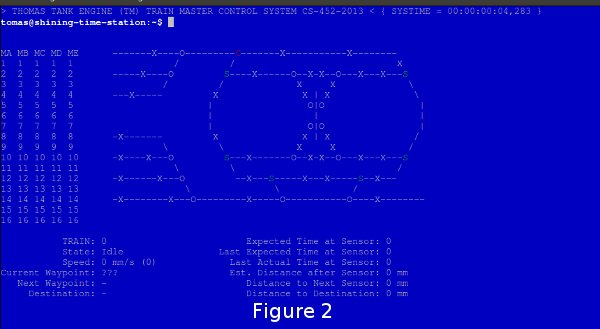
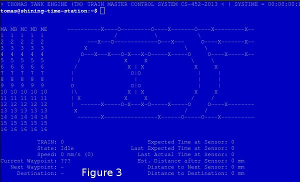
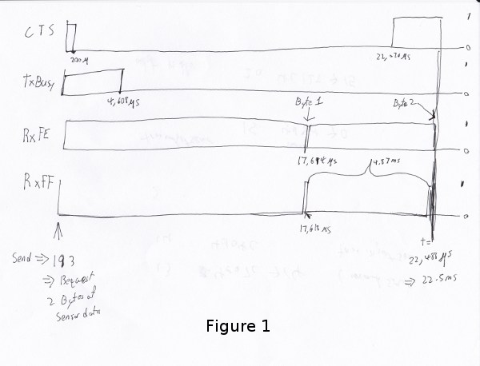
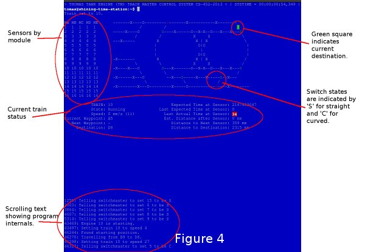

=========
CS 452 P2
=========

:Names: Robert Elder, Christopher Foo
:ID #: 20335246, 20309244
:Userids: relder, chfoo
:Date due: July 23, 2013

Running
=======

The executable is located at ``/u/cs452/tftp/ARM/relder-chfoo/p2-submit/kern.elf``.

The entry point is located at ``0x00045000`` or ``%{FREEMEMLO}`` It *must* be executed with caching enabled. (Caches not enabled by the program itself due to time contraints)::

    load -b %{FREEMEMLO} -h 10.15.167.4 ARM/relder-chfoo/p2-submit/kern.elf
    go -c

Commands
++++++++

tr TRAIN SPEED
    Set the train speed.

rv TRAIN
    Slows, stops, and reverses train. The final speed is hard coded to 5.

sw SWITCH DIRECTION
    Changes the turnout direction. DIRECTION is either S or C.

q
    Quits the program.

map NAME
    Sets the current track. NAME should be A or B.

Figure 2 and Figure 3 show different map configurations.

go TRAIN
    Begins the train route finding process. The train should start up, find position, and go to a random destination.

gf TRAIN
    Like ``go``, however, this make the train go forever by running ``go`` in an continuous loop.

num TRAINS
    Set the number of trains to be used.

paint
    Causes the interface to redraw itself.

rt
    Resets the train system by stopping the trains, clearing reservations, and clearing train engine states.

rps
    Runs Rock Paper Scissors program.

Pressing 'CTRL+Z' will cause the program to dump out a list of tasks information and statistics.   This is considered a debug operation, and as such it can cause future instability in the program.

Pressing CTRL+C will cause the program to exit immediately without shutting down the tasks.

Getting Started Quickly
-----------------------

To start up two trains

1. Select the appropriate map using the ``map`` command.
2. Set the number of trains to be used using ``num`` command.
3. Enter the first train using ``go TRAINNUM1 0``
4. Enter the second train using ``go TRAINNUM2 1``
5. If things go wrong, use the ``rt`` command

Description
===========

Kernel
++++++

* No kernel changes since last deliverable.

System Calls
------------

* System calls support up to 5 arguments.
* No changes since last deliverable.

``Create``
    Returns the new task id, ``ERR_K_INVALID_PRIORITY -1``, or ``ERR_K_OUT_OF_TD -2``

``MyTid``
    Returns the current task id

``MyParentTid``
    Returns the parent task id. The parent task id is always returned regardless of the parent's state.

``Pass``
    (Rescheduling happens as normal in the background.)

``Exit``
    Task is marked as ``ZOMBIE`` (and rescheduling happens as normal in the background).

``Send``
    Sends a message to the given task ID. ``-3`` code is not implemented.

``Receive``
    Blocks until a message is received. Returns the size of the message which will be typically ``MESSAGE_SIZE 16``

``Reply``
    Replies a message to the task. On errors ``-3`` ``-4``, an assert will fire before returning to aid in debugging.

``RegisterAs``
   Prepares a ``NameServerMessage`` structure with a message type of ``REGISTER_AS`` and sends the message to the Name Server. ``0`` is always returned because the Task ID is hard-coded and the call should never send to the wrong task.

``WhoIs``
    Prepares a ``WHO_IS`` message type and sends it to the Name Server. As noted in ``RegisterAs``, we either return a Task ID or 0 if the task has not been created. However, the task ID returned may be in a zombie state.

``AwaitEvent``
    Marks the task as ``EVENT_BLOCKED``. The task will be unblocked by the Scheduler. This call always returns 0 and the user task will be responsible for obtaining the data themselves. ``AwaitEvent`` supports only 1 task per event type.

``Time``
    Wraps a ``Send`` to the Clock Server. It first queries the Name Server for the Clock Server and then sends a ``TIME_REQUEST`` message. It expects back a ``TIME_REPLY`` message and returns the time.

``Delay``
    Similar to ``Time``, it sends a ``DELAY_REQUEST`` message and expects back a ``DELAY_REPLY`` message.

``DelayUntil``
    Similar to ``Time``, it sends a ``DELAY_UNTIL_REQUEST`` message and expects back a ``DELAY_REPLY`` message.

``TimeSeconds``, ``DelaySeconds``, ``DelayUntilSeconds``
    Same as above but in seconds. It simply converts the ticks into seconds before calling the system calls. These calls are simply for convenience.

``Getc``
    Sends a message to either Keyboard Input Server or Train Input Server. It will block until the servers have a character to return.

``Putc``
    Sends a message to either Screen Output Server or Train Output Server. The servers will place the character into the server's Char Buffer.

``PutString``
    Formats the string and calls ``Putc`` for every character.

``PutcAtomic``
    Like ``Putc``, but accepts multiple characters and guarantees the characters are placed into the queue sequentially. This call is useful to ensure that two byte commands are not separated by a single byte command.

``SendTrainCommand``
    Sends a message type ``TRAIN_COMMAND`` to the Train Command Server. The call is for convenience.

``PrintMessage``
    Similar to ``PrintMessage``, but this sends the string to the UI Print Server to be displayed on the lower half of the screen using a ``UI_PRINT_MESSAGE`` message type

Watchdog
--------

The watchdog has been changed to report starvation after 500,000 schedules to be more strict in detecting this problem.

Scheduler
---------

The scheduler now calculates the system load by counting the number of low priority schedules per 1,000,000 schedules. This may not reflect the true load as the Idle Task may take a long time slice before rescheduling. In the future deliverable, we may implement counting the time each task is scheduled.

Assert
++++++

The assert statement, as usual, is enhanced to show Thomas The Tank Engine. Please do not be alarmed when you see it.

When an assertion failure occurs, the Stop command will now be sent to avoid train collisions.

Serial IO
+++++++++

File: ``uart.c``

* FIFOs are now used for the terminal input/output.

Train Navigation
++++++++++++++++

File: ``route.c``, ``tracks/track_data.c``, ``train_logic.c``, ``train_data_structures.h``

Train navigation is currently accomplished using naive graph search algorithms, as well as a server called the SwitchMaster that is responsible for updating the positions of switches.

We have broken down the problem of navigation to anywhere on the map into two basic problems: The first is navigation to a point while considering the map as a directed graph.  In this situation we only consider moving in the forward direction.  In this context, it is not possible to navigate to anywhere on the map from all nodes because the graph is considered to be a directed one.  In the second case, we consider the map as an undirected graph, where any shortest path can be found by finding the shortest route in the undirected graph.  We can then express the problem of navigation between two points in the undirected graph as multiple navigations in a directed graph, while adding direction reversals in the middle.

To find a destination, a simple depth first recursive algorithm is used to build up a Route Info array. The Route Info array contains information about each track node and the switches it needs to switch. The algorithm avoids blacklisted switches.

Undirected Nodes and Adjacency List
-----------------------------------

TODO

Stopping
--------

For stopping we use a roughly approximated table for each train that will tell us how many millimeters before a sensor we need to issue a command to slow down.  This table was derived from empirical measurements and still needs a bit of calibration.  This is especially true on a specific train level, since different trains require different stopping distances.

A list of speeds for each node during stopping has also been determined empirically. Nodes that are near switches have a lower speed to avoid stopping on top of a switch. We risk the trains getting stuck on curves because it is preferred that trains become stuck rather than derailed by an activating switch.

Velocity
--------

Our trains move at a speed of 45 cm/s and we maintain this speed using a feedback control mechanism. The trains use a floating point speed setting to avoid sending too many train speed commands and to dampen noise. The floating point speed setting is casted to an int and the command is issued if needed. The algorithm slowly increases the train speed when it arrives at a sensor too slowly, and decreases the speed quickly when it arrives too fast.

Sensor Malfunctions
-------------------

Sensor malfunctions are accounted for by maintaining a list of sensors that are known to malfunction on each track.  We use a blacklist of sensors to remember which sensors should not be navigated to, and which should be ignored when determining the train position.

Reservations
------------

The provided track nodes have been modified with an extra field called ``reserved``. It holds the train number of the reservation. Once the destination and route is calculated, all the nodes in the route are reserved. Once the train reaches its destination, the nodes are released from reservation.

Train Switch Master
-------------------

The Switch Master is responsible for picking up switch commands from the Train Server and calling Train Command Server. This task is a worker that removes the burden of waiting for train commands to complete.

Train Engine Client
-------------------

The Engine Client is responsible for picking up train speed commands from the Train Server and calling the Train Command Server. Like the Switch Master, the task is a worker hired by the Train Server.

Train Engine States
-------------------

================================= =================================================================
Name                              Description
================================= =================================================================
IDLE                              The engine is stopped and waiting.
FINDING_POSITION                  The engine is moving slowly and waiting for a sensor
RESYNC_POSITION                   The engine has drifted from its calculated position and
                                  is attempting to find its location
FOUND_STARTING_POSITION           The engine has found its location
WAIT_FOR_DESTINATION              The engine is waiting for a destination to be calculated
GOT_DESTINATION                   The engine has calculated its destination
WAIT_FOR_ALL_READY                The engine is waiting for other engines to be found and ready
RUNNING                           The engine is running at high speeds to the destination
AT_DESTINATION                    The engine is at the destination and stopped.
NEAR_DESTINATION                  The engine has slowed down and is waiting for a
                                  sensor report.
REVERSE_AND_TRY_AGAIN             The engine is in a direction that provides no
                                  destination and is reversing to find a new
                                  sensor.
WAIT_FOR_RESERVATION              The engine has stopped and is waiting for the track to become 
                                  unreserved
WRONG_LOCATION                    The engine has entered an unauthorized section of the track
================================= =================================================================

GO
--

The go command operates as following:

1. Set the train speed to 5.
2. If a sensor is hit, pick a random destination.
3. Calculate a route to the destination.
4. If there are other trains that need to find their destination, wait for them.
5. Speed up the train to 14.
6. Using feedback control system, adjust the speed to achieve a speed of 45 cm/s.
7. If the distance to destination is within the stopping distance, slow the train down.
8. Wait for a sensor and stop.

For an iterative version of the go command, see GF command which will iteratively use the go command after a train reaches its destination.

GF
--

The gf command operates as following:

1. Do steps 1-8 of the go command
3. Wait for 4 seconds
3. Goto step 1

UI Servers
++++++++++

Files used by UI servers: ``ui.c``, ``ansi.c``, ``maps/map_gen.py``, ``maps/map_a.txt``, ``maps/map_b.txt``

UI Server
---------

* CR LF is handled correctly now.
* Minor bug: certain inputs will cause assertion failures.

The UI Server is responsible for drawing the textual user interface. It draws a header, the time since start up, a system load indicator expressed in percentage, the command prompt, table of sensors readings, an ASCII diagram of the track layout, a table of train status, and a scrolled area of train information.

The command prompt supports up to 80 characters. Once this limit is reached, no input will be accepted and displayed. It supports backspace. Pressing the Enter key will execute the command and a response will be displayed under the command prompt. If an error occurs, it will be shown in yellow.

When a sensor is triggered, the UI Server will display an bold number on the table. Sensor data for the UI is cached by the Train Server so displayed sensor readings may not reflect actual state. Sensor states in the Train Server, however, reflect actual states.

The ASCII map shows sensors as X and bold X. Switches are shown as U, C, or S which represent Unknown, Curved, or Straight. The ASCII map code was generated through a script from a text file.

A green highlight shows the destination of the first train. A yellow highlight shows the destination for other trains.

A black highlight shows the reservation of the first train. A red highlight shows the reservation for other trains.

Some of the hilights of the UI are found in figure 4.

UI Timer
--------

The UI Timer is responsible for sending a message to the UI Server. The timer tells the UI to update the clock on the screen.

UI Keyboard Input Task
----------------------

The UI Keyboard Input task is responsible for calling ``Getc`` and sending the character to the UI Server.

UI Print Message Task
---------------------

This task is responsible for printing messages into the scrolled area. It uses the ANSI feature to set scrolling areas. It is separate from the UI Server as messages may be from higher priority tasks like the Train Server. It is called via the ``PrintMessage`` call.  This method was implemented as a non busy-waiting alternative for debug messages.

Performance
+++++++++++

In this deliverable we have several features that significantly improve the performance of our kernel:

1)  The priorities were adjusted to achieve the following

    * Notifiers have high priority
    * The UI keyboard input no longer drops characters while the UI is redrawing.
    * The Switch Master and Train Speed Client are at higher priorities than the Sensor Reader. This setup is necessary to avoid the trains getting caught on the switches.

2)  FIFOs for the terminal were enabled. Without FIFOs, the UI task may be interrupted during sending ANSI sequences and leaving incomplete sequences on the screen. With FIFOs, the screen updates correctly without flickering.

Source Code
===========

The source code is located at ``/u4/chfoo/cs452/group/p2-submit/io/project1/``. It can be compiled by running ``make``.

Source code MD5 hashes::

    TODO
    TODO
    TODO

Elf MD5 hash::

    TODO

Git sha1 hash: ``TODO``

